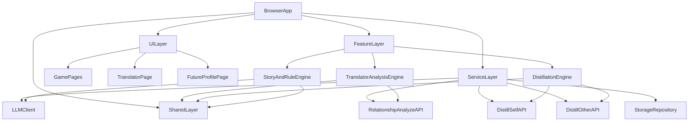
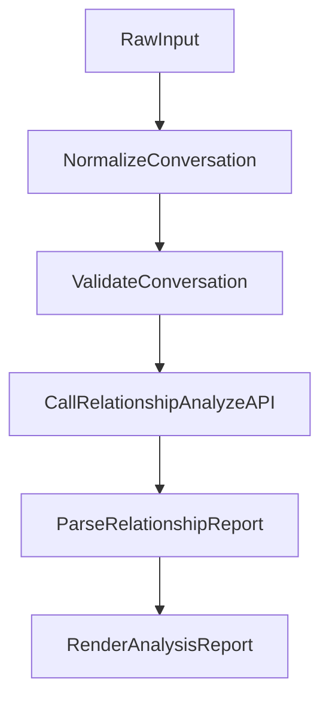
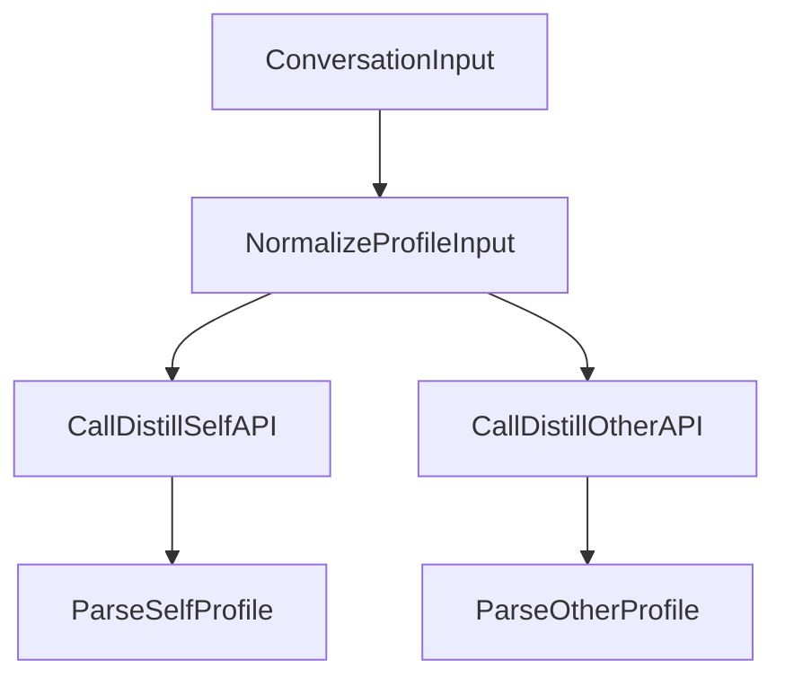

# Architecture

## 1. 文档定位

本文档是当前阶段唯一生效的总体技术架构文档。

它配合 `docs/PRD.md` 使用，负责统一以下内容：

- 当前项目的技术分层
- 游戏、翻译器、蒸馏三条能力线的边界
- 共享输入结构和输出 schema 的组织方式
- API 与服务层的职责
- 两个人的工程分工、联调顺序和验收边界

## 2. 当前阶段架构目标

当前阶段的架构不是为了继续把项目做成一个更大的聊天机器人，而是为了同时满足三件事情：

1. 游戏大框架保留
2. 翻译器分析主线可以独立完成正式交付
3. 蒸馏能力主线可以并行研发并为未来能力做准备

所以当前架构的核心目标是：

- 共享基础能力
- 独立落地两条主线
- 降低两个人相互等待和互相阻塞

## 3. 当前总体结构



## 4. 技术分层

### 4.1 UI Layer

负责：

- 页面输入
- 页面展示
- 加载态、空态、错误态
- 交互反馈

不负责：

- 直接拼 prompt
- 直接发原始模型请求
- 组织复杂业务判断

建议目录：

- `src/pages/`
- `src/components/`

### 4.2 Feature Layer

负责：

- 输入清洗
- 业务流程编排
- 多步骤结果拆分
- 规则系统与模型结果之间的衔接

这一层是当前最重要的业务沉淀层。

建议目录：

- `src/features/translator/`
- `src/features/reply/`
- `src/features/pollution/`
- 新增蒸馏相关 `src/features/`

### 4.3 Service Layer

负责：

- 对外 API 请求封装
- LLM 请求封装
- 超时、重试、异常
- 结构化结果清洗与校验

建议目录：

- `src/services/api/`
- `src/services/storage/`

### 4.4 Shared Layer

负责：

- 输入结构
- 输出 schema
- 公共枚举
- 公共工具函数
- 错误结构

建议目录：

- `src/types/`
- `src/config/`
- 必要的 `src/utils/`

## 5. 三条能力线的职责边界

### 5.1 游戏主线

技术职责：

- 保留剧情规则
- 保留状态机
- 保留污染机制
- 保留游戏页面与世界观体验

明确不承担：

- 正式关系分析报告
- 蒸馏能力核心输出

### 5.2 翻译器分析主线

技术职责：

- 接收聊天记录输入
- 标准化聊天记录
- 调用关系分析服务
- 输出结构化关系报告
- 渲染报告页

明确不承担：

- 海量单句候选回复生成
- 自动代聊
- 依赖蒸馏完成后才能上线

### 5.3 蒸馏能力主线

技术职责：

- 从聊天记录中提取用户风格画像
- 从聊天记录中提取对方风格画像
- 输出结构化 profile
- 为后续模拟对话、风格改写和更长期记忆提供可复用能力

明确不承担：

- 替代翻译器分析主线
- 影响翻译器首版联调节奏

## 6. 共享输入结构

翻译器分析和蒸馏能力必须共用一套基础输入结构。

推荐结构：

- `speaker`
- `content`
- `timestamp`
- `metadata`

建议定义一个基础消息结构，例如：

```ts
type ConversationMessage = {
  speaker: "self" | "other";
  content: string;
  timestamp?: string;
  metadata?: Record<string, unknown>;
};
```

这样做的原因：

- 翻译器和蒸馏可以复用输入
- 后续截图识别或导入能力也能转成统一结构
- 有利于前后端统一契约

## 7. 翻译器分析链路

### 7.1 输入阶段

输入来自页面层，先进入业务层做标准化：

- 去除空行
- 统一说话人标记
- 按顺序整理消息
- 处理缺失字段

### 7.2 编排阶段

业务层负责将标准化后的消息送入分析服务。

推荐流程：



### 7.3 输出阶段

翻译器分析结果建议统一为以下结构：

- `summary`
- `selfProfile`
- `otherProfile`
- `interactionPattern`
- `keyMoments`
- `mainIssues`
- `communicationAdvice`

### 7.4 工程要求

- 输出必须结构化
- 前端必须能分块渲染
- 出错时必须能明确区分“无结果”和“失败”
- 不允许用预设文本伪装正式分析结果

## 8. 蒸馏能力链路

### 8.1 输入阶段

蒸馏能力复用和翻译器相同的聊天记录基础结构。

### 8.2 编排阶段

蒸馏链路在业务层中独立组织：



### 8.3 输出阶段

建议形成两类结果：

- `SelfProfile`
- `OtherProfile`

每个 profile 至少要包含：

- 表达风格
- 情绪表达方式
- 沟通习惯
- 互动偏好

### 8.4 工程要求

- 自我蒸馏和对方蒸馏结构明确分开
- 字段命名统一
- 输出可被未来功能直接复用

## 9. API 边界

当前阶段建议保留或新增以下正式接口：

- `POST /api/love-translate`
- `POST /api/relationship-analyze`
- `POST /api/distill-self`
- `POST /api/distill-other`

各接口职责：

- `love-translate`：保留旧的句子级翻译能力
- `relationship-analyze`：输入聊天记录，返回结构化关系分析报告
- `distill-self`：输入聊天记录，返回用户表达画像
- `distill-other`：输入聊天记录，返回对方互动画像

## 10. Schema 设计建议

### 10.1 翻译器分析结果

建议结果结构：

```ts
type RelationshipReport = {
  summary: string;
  selfProfile: string[];
  otherProfile: string[];
  interactionPattern: string[];
  keyMoments: Array<{
    quote: string;
    reason: string;
  }>;
  mainIssues: string[];
  communicationAdvice: string[];
};
```

### 10.2 蒸馏结果

建议结果结构：

```ts
type DistilledProfile = {
  styleTags: string[];
  emotionalTraits: string[];
  communicationHabits: string[];
  relationshipSignals: string[];
};
```

说明：

- 具体字段名称后续可以调整
- 但必须保证前端可以按块渲染
- 不建议只返回一大段自由文本

## 11. 错误处理原则

当前阶段的错误处理要遵守以下规则：

1. 错误可以存在，但不能被伪装成成功
2. 返回空结构和请求失败必须区分
3. 页面必须显示用户可理解的错误提示
4. 调试信息和用户展示信息要分离

典型错误场景：

- 输入为空
- 输入结构无法解析
- 接口超时
- 模型输出不符合 schema

## 12. 缓存与存储建议

当前阶段不需要上复杂长期存储，但建议保留基础缓存能力。

可考虑：

- 最近一次分析结果缓存
- 最近一次输入聊天记录缓存
- 后续蒸馏结果本地缓存

目的：

- 降低重复输入成本
- 方便调试和演示
- 为后续扩展历史记录做准备

## 13. 两个人的详细工程任务

### 开发者 A：翻译器分析工程负责人

负责整条翻译器主链路，不只是页面层。

详细任务：

1. 设计并实现 `TranslatorPage` 页面结构
2. 实现聊天记录输入区
3. 实现输入清洗和角色整理逻辑
4. 设计分析结果 schema
5. 在 `src/features/translator/` 中完成分析业务编排
6. 在 `src/services/api/` 中接入 `relationship-analyze`
7. 实现报告页渲染
8. 实现关键片段和摘要模块
9. 完成空态、加载态、错误态
10. 完成最终联调和演示闭环

负责目录建议：

- `src/pages/TranslatorPage/`
- `src/features/translator/`
- `src/services/api/` 中分析相关部分
- `src/types/` 中分析相关部分

验收标准：

- 输入聊天记录后稳定生成报告
- 报告结构前后端一致
- 页面不是调试板，而是用户可读结果
- 错误路径清晰

### 开发者 B：蒸馏能力工程负责人

负责蒸馏能力的独立工程闭环和后续复用性设计。

详细任务：

1. 设计 `SelfProfile` schema
2. 设计 `OtherProfile` schema
3. 统一蒸馏相关字段、标签和枚举
4. 实现蒸馏输入标准化逻辑
5. 在服务层接入 `distill-self`
6. 在服务层接入 `distill-other`
7. 完成蒸馏结果清洗和校验
8. 预留与翻译器和模拟对话的衔接点
9. 输出可长期复用的画像结构

负责目录建议：

- 新增蒸馏相关 `src/features/`
- `src/services/api/` 中蒸馏相关部分
- `src/types/` 中蒸馏相关部分

验收标准：

- 输入聊天记录后可稳定输出蒸馏画像
- 自我蒸馏和对方蒸馏边界清晰
- 输出结构可被后续功能直接复用
- 不影响翻译器主线推进

## 14. 联调顺序

推荐联调顺序：

1. 先统一聊天记录输入结构
2. 开发者 A 独立完成翻译器分析链路
3. 开发者 B 独立完成蒸馏链路
4. 最后在共享类型、服务入口和结果复用上做收口联调

这样可以减少两个人来回等待。

## 15. 当前阶段保留与删减原则

### 保留

- 原有游戏大框架
- 原有 `PRD1`
- 当前新的大 PRD
- 当前新的大 Architecture

### 删减

- 独立实施计划文档
- 个人工作入口文档
- 零散重复说明文档
- 过度强调“单句回复”的旧表述

## 16. 架构结论

当前最合理的技术路线不是做一个大而全的聊天 AI，而是：

- 用游戏线保留项目作品感
- 用翻译器分析线承接当前正式价值
- 用蒸馏能力线积累未来个性化基础

技术上要实现的是：

- 共享底层结构
- 独立推进两条主线
- 后续自然联动，而不是一开始就硬耦合
