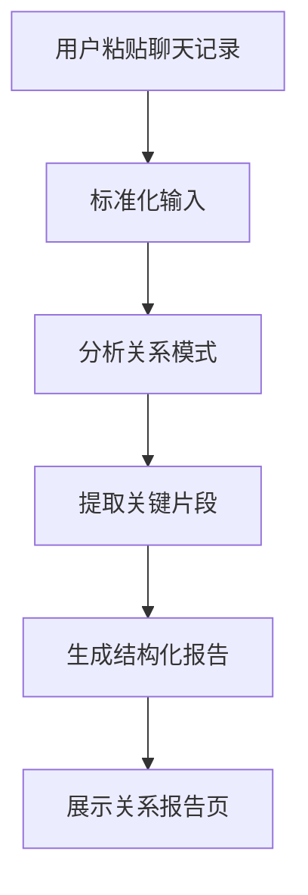

# PRD

## 1. 文档定位

本文档是当前阶段唯一生效的产品需求文档。

它取代此前所有零散的实施说明、分工说明和阶段性翻译器说明，统一回答四个问题：

- 当前阶段到底做什么
- 当前阶段明确不做什么
- 产品价值和页面结果应该长什么样
- 两个人分别做什么，做到什么程度算完成

当前仓库文档只保留四份核心文件：

- `README.md`：项目总结
- `ta说_PRD_最终版.md`：旧版 `PRD1`，作为历史基线保留
- `docs/PRD.md`：当前阶段唯一大 PRD
- `docs/Architecture.md`：当前阶段唯一大 Architecture

## 2. 项目背景

`TA 说` 原本是一个“前半段恋爱 Meta 恐怖互动作品，后半段恋爱翻译器”的项目。

这个大方向不变，但当前阶段的开发重点已经发生变化：

- 游戏大框架继续保留
- 当前正式交付重点转向翻译器
- 翻译器的主价值从“单句回复建议”升级为“聊天关系分析”
- 另一个并行方向是“蒸馏自己 / 蒸馏别人”

也就是说，这一阶段不是继续扩写游戏功能，而是把后半段真正做成一个有产品价值的能力。

## 3. 一句话定义

`TA 说` 当前阶段要做的是一个基于历史聊天记录的关系分析器，它帮助用户看懂双方怎么聊天、关系卡在哪里、自己有哪些表达模式，以及接下来应该往什么方向沟通。

## 4. Slogan

让天下没有难回的消息

## 5. 当前阶段产品目标

当前阶段的核心目标不是“帮用户秒回一句漂亮话”，而是让用户在看完一份报告后，明显更理解这段关系。

具体来说，要让用户得到这四层价值：

### 5.1 看懂双方

让用户知道：

- 自己通常怎么表达
- 对方通常怎么回应
- 双方在节奏、情绪、表达方式上是怎么错位的

### 5.2 看懂关系

让用户知道：

- 当前关系是推进、拉扯、降温还是误解累积
- 哪些聊天节点造成了关系变化
- 问题到底是内容问题、节奏问题、情绪问题，还是理解方式的问题

### 5.3 看懂自己

让用户看到自己在关系中的稳定模式，比如：

- 习惯试探
- 容易嘴硬
- 需求表达偏晚
- 过度解释
- 怕暴露需求感

### 5.4 得到方向

系统给用户的应该是高层级判断：

- 接下来更适合主动还是观察
- 更适合表达自己还是先确认对方意图
- 更适合降温还是澄清
- 更适合停止脑补还是继续推进

## 6. 为什么这样做

如果我们把翻译器做成“单句回复器”，它会立刻陷入和普通大模型的直接竞争：

- 用户会比较谁更像高情商模板机
- 用户会比较谁更会续写一句话
- 用户会把产品理解成代聊工具

这条路同质化太强，而且很难建立真正的长期差异。

但如果我们把重点放在“历史聊天关系分析”，情况就不一样了：

- 产品价值从一句话上移到一段关系
- 输出从临时文案变成结构化洞察
- 用户感知从“它会写”变成“它看懂了”

所以当前阶段的正确定位，不是“回复助手”，而是“关系分析器”。

## 7. 产品边界

### 7.1 当前阶段要做

- 输入一段历史聊天记录
- 标准化和结构化聊天内容
- 生成双方沟通模式分析
- 生成关系状态分析
- 提炼关键转折片段
- 输出方向性沟通建议
- 为未来蒸馏能力预留可复用输入结构

### 7.2 当前阶段不做

- 不做开放式陪聊
- 不做自动代聊
- 不做大量单句候选回复生成
- 不做“一键帮你回”
- 不做精准预测对方真实想法
- 不做心理诊断或人格测试产品

## 8. 产品结构

当前产品在产品层面由三块组成：

### 8.1 游戏保留层

负责保留原有作品感，包括：

- 恋爱 Meta 恐怖气质
- 聊天式叙事体验
- 反义污染与异常感

当前策略：

- 保留
- 不继续作为当前文档重点展开
- 不删除原有产品大设定

### 8.2 翻译器分析主线

这是当前阶段第一优先级，也是本 PRD 的主要对象。

它负责：

- 输入聊天记录
- 输出关系分析报告
- 呈现双方互动模式
- 给出高层级沟通方向

### 8.3 蒸馏能力主线

这是当前阶段第二优先级，由另一位开发者独立推进。

它负责：

- 蒸馏自己
- 蒸馏别人
- 沉淀用户和对方的表达画像
- 为未来模拟对话、个性化表达和更强分析做准备

## 9. 目标用户

当前阶段主要面向以下三类用户：

### 9.1 暧昧关系用户

典型问题：

- 不确定对方态度
- 每次看聊天记录都会脑补很多
- 很难判断该推进还是该收住

### 9.2 亲密关系沟通受挫用户

典型问题：

- 明明都在意，却总是越聊越偏
- 经常卡在语气、节奏和表达方式上
- 总觉得“不是不爱，是不会说”

### 9.3 高频聊天焦虑用户

典型问题：

- 总想复盘聊天记录
- 总觉得“是不是我哪里说错了”
- 想知道自己和对方到底在重复什么模式

## 10. 关键用户问题

本期产品重点解决的，不是单点回复问题，而是以下四类大问题：

1. 我们两个人分别是怎么聊天的？
2. 我们为什么总在类似的地方卡住？
3. 这段关系现在到底处于什么状态？
4. 我接下来更适合往哪个方向沟通？

## 11. 核心功能范围

### 功能 1：聊天记录输入

用户输入一段历史聊天记录，作为分析材料。

第一期要求：

- 支持纯文本粘贴
- 支持按说话人分隔
- 支持简单顺序整理

第一期不要求：

- 截图 OCR
- 平台自动导入
- 自动识别说话人

### 功能 2：关系分析报告

这是核心输出。

报告至少包含以下模块：

- 当前关系摘要
- 用户表达风格
- 对方互动风格
- 双方互动模式
- 当前主要问题
- 关键聊天片段
- 沟通方向建议

### 功能 3：关键片段证据化

如果系统只给结论，用户会觉得空泛。所以报告里必须有一部分是“证据”。

至少要体现：

- 哪些对话能支撑对用户模式的判断
- 哪些对话能支撑对对方模式的判断
- 哪些对话是关系转折点

### 功能 4：方向性建议

本期建议只做高层级方向判断，不做海量回复模板。

建议的形式应该是：

- 现在适合推进还是观察
- 适合先表达还是先确认
- 适合澄清还是降压
- 适合收缩情绪还是提升明确度

必要时可给一小段表达范式，但不能喧宾夺主。

## 12. 结果页设计原则

翻译器的结果页应该被设计成“报告页”，而不是“回复面板”。

建议页面结构：

1. 关系概览
2. 你是怎么聊天的
3. 对方是怎么聊天的
4. 你们为何容易错位
5. 哪些对话最关键
6. 接下来更适合怎么处理

设计原则：

- 先给关系摘要，再展开细项
- 先给分析，再给建议
- 每个判断最好有对应证据
- 让用户一眼看懂重点，不要像调试页面

## 13. 用户流程

## 14. 输出数据结构

分析结果建议统一为单独结构，不和旧的句子翻译结果混用。

推荐字段：

- `conversationInput`
- `summary`
- `selfProfile`
- `otherProfile`
- `interactionPattern`
- `keyMoments`
- `mainIssues`
- `communicationAdvice`

字段含义：

- `summary`：一句话总结当前关系状态
- `selfProfile`：用户的表达习惯、问题和优势
- `otherProfile`：对方的互动风格和倾向
- `interactionPattern`：双方为什么容易错位
- `keyMoments`：支撑分析判断的关键片段
- `mainIssues`：当前最重要的问题点
- `communicationAdvice`：下一步沟通方向建议

## 15. 成功标准

如果这期产品做对了，用户会自然产生这些感受：

- 它不是在替我回一句话，而是在帮我看懂这段关系
- 它说中了我和对方的聊天模式
- 它让我意识到问题不是单句，而是长期重复的模式

如果用户只觉得“这又是一个生成话术的工具”，说明产品方向没有立住。

## 16. 详细人员分工

当前阶段仍由两个人并行推进，但分工方式不是“一起做一个功能”，而是“一人负责一条完整主线”。

### 开发者 A：翻译器分析主负责人

这个人负责翻译器主线的完整交付，从输入到报告展示都由他串起来。

职责范围：

1. 梳理 `TranslatorPage` 的页面结构
2. 完成聊天记录输入区
3. 设计结果页信息层级
4. 定义分析结果 schema
5. 打通分析服务和页面渲染
6. 完成关键片段模块
7. 完成加载态、空态、失败态
8. 形成最终可演示版本

建议负责目录：

- `src/pages/TranslatorPage/`
- `src/features/translator/`
- `src/types/` 中分析相关类型
- `src/services/api/` 中分析相关能力

交付标准：

- 用户输入聊天记录后能稳定获得分析报告
- 页面重点突出“关系分析”，不是调试信息
- 报告里能看出具体聊天证据
- 整体流程可直接演示

### 开发者 B：蒸馏能力主负责人

这个人独立推进蒸馏能力，为后续个性化能力打底，不阻塞翻译器首版。

职责范围：

1. 定义 `蒸馏自己` 的输入输出结构
2. 定义 `蒸馏别人` 的输入输出结构
3. 设计用户画像字段
4. 设计对方画像字段
5. 封装蒸馏相关 API 能力
6. 完成蒸馏结果清洗与结构化
7. 预留和翻译器、模拟对话的接口点

建议负责目录：

- 新增蒸馏相关 `src/features/` 目录
- `src/services/api/` 中蒸馏相关能力
- `src/types/` 中蒸馏画像类型

交付标准：

- 能从聊天记录稳定生成结构化画像
- 自我蒸馏和对方蒸馏边界清晰
- 结果可复用到后续功能
- 不阻塞翻译器分析主线联调

## 17. 两个人的协作规则

虽然两个人分别负责不同主线，但以下内容必须统一：

- 聊天记录输入格式
- 说话人标记方式
- 公共时间顺序结构
- 公共错误结构
- LLM 服务调用入口

推荐协作顺序：

1. 先统一输入结构
2. 再分别定义分析 schema 和蒸馏 schema
3. 服务层统一调用方式
4. 页面层和结果展示分别推进

## 18. 开发优先级

### P0

- 聊天记录输入
- 分析 schema
- 关系分析服务
- 报告页渲染

### P1

- 关键片段提炼
- 更好的证据化呈现
- 蒸馏 schema 与蒸馏接口

### P2

- 翻译器分析和蒸馏结果联动
- 报告分享感增强
- 更长期的多轮分析能力

## 19. 风险与应对

### 风险一：分析太像套话

应对：

- 强制输出关键片段
- 限制标签数量
- 每个结论尽量有聊天证据

### 风险二：产品滑回回复工具

应对：

- 页面以报告组织，不以回复组织
- 方向建议大于句子建议
- 文案避免“一键帮你回”

### 风险三：两条主线互相卡住

应对：

- 翻译器分析优先独立闭环
- 蒸馏能力独立推进
- 只共享必要契约，不共享复杂页面逻辑

## 20. 当前阶段结论

当前阶段最重要的不是做一个更会聊天的 AI，而是做一个真正能“看懂关系”的翻译器。

产品上，用翻译器分析建立正式价值。
研发上，用蒸馏能力储备下一阶段差异化。
文档上，用这一份 PRD 统一当前阶段所有产品口径。
