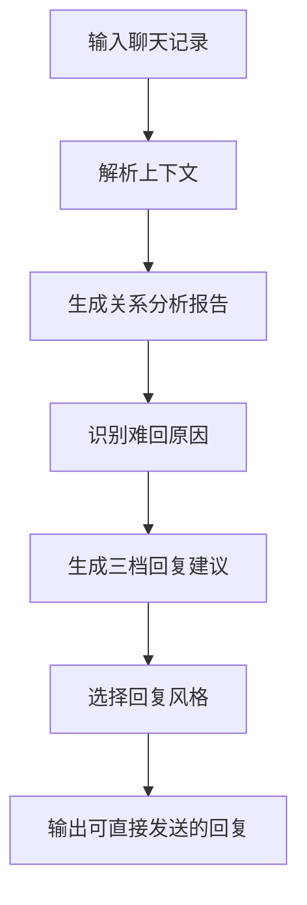
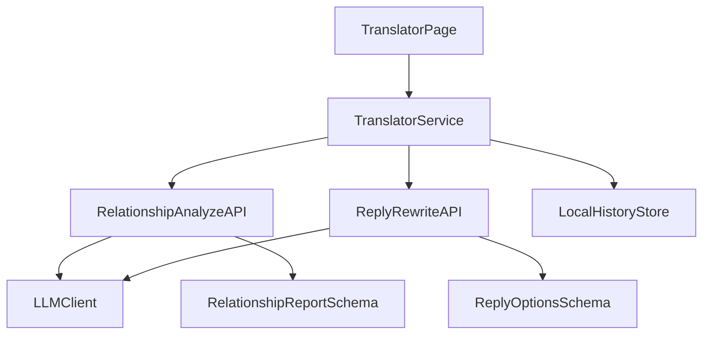

# 翻译器 PRD（关系分析优先版）

## 1. 文档目标

本文档是面向当前开发阶段的新 PRD，服务于翻译器方向的集中推进。

它要解决三件事：

- 用一句更清晰的话定义这期产品到底在做什么。
- 把功能范围收敛成一个能快速落地的 MVP。
- 给两位开发同学明确分工和可执行架构，避免继续混做成“普通聊天大模型”。

## 2. 项目定义

### 项目名称

`TA 说` 翻译器二期

### Slogan

让天下没有难回的消息

### 一句话介绍

这不是一个泛聊天助手，而是一个面向亲密关系与高情绪密度对话的消息分析与回复辅助工具。它能从历史聊天中识别双方的表达模式、互动关系和卡点，再给出更适合这段关系的回复建议。

### 当前阶段产品定位

本阶段优先做成：

**基于历史聊天记录的关系沟通分析器。**

用户上传或粘贴一段聊天记录后，系统不只翻译某一句话，而是回答四个问题：

1. 这两个人分别是怎么聊天的？
2. 当前关系卡在什么地方？
3. 为什么这条消息很难回？
4. 下一步更主动但不越界的回复应该怎么说？

## 3. 为什么做

很多“难回的消息”并不是因为用户不会打字，而是因为用户同时在处理这几层压力：

- 不确定对方真实态度。
- 不想显得太主动、太需要、太情绪化。
- 知道自己应该回复，但不知道怎么既表达自己又不把关系聊死。

普通大模型通常只能做两类事：

- 直接续写一句“高情商回复”。
- 对单条消息做表面润色。

它们的问题是：

- 不理解这段关系的上下文。
- 不区分“对不同的人应该怎么说”。
- 不能稳定输出“为什么这样建议”的结构化解释。

所以我们的差异化不该是“更会续写”，而该是：

**理解一段关系，再帮助用户做更容易被接住的表达。**

## 4. 目标用户

第一阶段聚焦三类用户：

- 暧昧关系中的年轻用户：想回消息，但怕暴露需求感。
- 情侣或关系拉扯中的用户：经常因为语气、节奏、预期不同而误解。
- 高频聊天焦虑用户：常见场景是“这条该怎么回”“为什么 TA 总这样回我”。

## 5. 核心价值主张

本产品提供的不是单点文案生成，而是三层价值：

### 5.1 先看懂

从历史聊天中总结双方表达特征、互动节奏和关系模式。

### 5.2 再解释

指出这条消息为什么难回，难点来自哪里，是情绪、关系、时机还是措辞。

### 5.3 再给方案

给出更适合当前关系的一句话或多种回复方案，并解释每种方案会带来什么走向。

## 6. 本期目标与非目标

### 本期目标

完成一个可稳定使用的翻译器 MVP，支持：

- 输入一段聊天记录。
- 输出结构化关系分析报告。
- 针对当前最后一条消息生成 3 类回复建议。
- 给出“更主动但不失控”的沟通策略提示。

### 本期非目标

本期不做以下内容，避免发散：

- 不做开放式陪聊机器人。
- 不做完整的“对方人格预测系统”。
- 不做第三方平台自动代聊。
- 不做心理诊断、MBTI 测试或情感治疗产品。
- 不承诺“准确看透对方真实想法”。

## 7. MVP 功能范围

### 功能 1：聊天记录关系分析

用户粘贴一段聊天记录，系统输出一份结构化报告。

报告至少包含：

- 我的表达特征
- 对方的互动特征
- 当前关系模式
- 这段对话的主要阻塞点
- 建议的下一步沟通策略

示例输出维度：

- 我是否习惯试探、绕弯、嘴硬、过度解释、延迟表达需求
- 对方是否回避、模糊、礼貌维持、忽冷忽热、偏被动
- 当前关系是推进中、拉扯中、降温中还是误解累积中

### 功能 2：难回消息拆解

围绕最后一条待回复消息，系统解释：

- 这条消息表面在说什么
- 它可能在释放什么关系信号
- 用户为什么会觉得难回
- 哪种回复策略更稳妥

### 功能 3：三档回复建议

针对最后一条消息，至少生成三档回复：

- 稳妥版：不冒进，降低误解
- 主动版：更清晰表达意图
- 轻松版：减压、保留空间

每条建议都要带简短说明，告诉用户为什么适合当前关系。

### 功能 4：更像用户自己的表达

在生成回复时，不只给“标准答案”，而是尽量保留用户原本的表达风格。

第一期不做完整“蒸馏自己”，但要先实现轻量版本：

- 保守
- 直接
- 温柔
- 俏皮

这四类风格可作为回复生成时的控制参数。

## 8. 用户流程

## 9. 关键体验原则

### 9.1 不装懂

系统输出必须用“基于对话模式推断”这类表达，不能把推断说成事实。

### 9.2 先解释再建议

用户更需要的是“为什么”，不是一上来就给一句套话。

### 9.3 让建议有关系上下文

回复建议必须体现对双方互动模式的理解，否则就会退化成普通模型。

### 9.4 主动性不是冒进

“更主动”指的是更清楚、更合适地表达，而不是更频繁、更猛烈地输出。

## 10. 核心数据结构建议

建议新增独立的关系分析结果类型，不和现有单句翻译结果混在一起。

建议结构：

- `inputConversation`
- `selfProfile`
- `otherProfile`
- `relationshipPattern`
- `replyDifficulty`
- `strategyAdvice`
- `replyOptions`

其中：

- `selfProfile` 描述用户表达习惯
- `otherProfile` 描述对方互动习惯
- `relationshipPattern` 描述双方当前相处状态
- `replyDifficulty` 解释这条消息难回的原因
- `strategyAdvice` 给出沟通建议
- `replyOptions` 给出不同风格的可发送回复

## 11. 技术架构

### 11.1 架构原则

- 页面组件不直接拼 prompt 或调用模型。
- 单句翻译与关系分析必须拆成两条服务能力。
- 关系分析结果必须结构化，不能只返回一段自由文本。
- 回复建议必须基于分析结果生成，而不是和分析完全脱节。
- 错误状态要明确展示，不能用假结果伪装成功。

### 11.2 整体架构

### 11.3 模块职责

#### 页面层

负责：

- 聊天记录输入
- 风格参数选择
- 报告展示
- 回复结果展示

建议承载位置：

- `src/pages/TranslatorPage/`

#### 业务层

负责：

- 输入清洗
- 对话分段
- 分析请求编排
- 回复建议请求编排
- 结构化结果校验

建议承载位置：

- `src/features/translator/`

#### 服务层

负责：

- 封装模型接口
- 提供分析与回复改写两个独立能力
- 处理超时、重试和错误态

建议承载位置：

- `src/services/api/`

#### 类型层

负责：

- 关系分析 schema
- 回复建议 schema
- 前后端契约

建议承载位置：

- `src/types/`

### 11.4 推荐接口

本期建议至少抽出两个正式能力：

- `POST /api/relationship-analyze`
- `POST /api/reply-suggest`

接口职责：

- `relationship-analyze`：输入聊天记录，返回结构化关系报告
- `reply-suggest`：基于关系报告和最后一条消息，返回多档回复建议

### 11.5 推荐调用链

1. 用户粘贴聊天记录
2. 前端调用 `relationship-analyze`
3. 服务端返回结构化分析报告
4. 前端展示报告后，再调用 `reply-suggest`
5. 前端展示三档建议与说明

这样拆分的好处是：

- 分析结果可以复用
- 便于后续接“蒸馏自己”
- 便于后续接“对方回应倾向模拟”

## 12. 开发分工

本轮建议按“前台体验 + 分析引擎”来拆，而不是按页面机械拆分。

### 开发者 A：前端体验负责人

负责内容：

- 翻译器页面信息架构调整
- 聊天记录输入区、分析报告区、回复建议区 UI
- 风格选择与交互状态
- 加载态、失败态、空状态
- 报告结果的可读性与分享感

需要协作的文件范围建议：

- `src/pages/TranslatorPage/`
- `src/components/`
- `src/styles/` 或相关样式目录

验收标准：

- 用户能顺畅完成“输入 -> 分析 -> 拿到建议”的单路径闭环
- 报告结构清晰，不像调试面板
- 结果页支持后续扩展更多分析字段

### 开发者 B：分析链路负责人

负责内容：

- 关系分析 schema 设计
- 分析与回复建议 API 契约
- `translatorService` 扩展
- `llmClient` 新能力接入
- 返回结果清洗、校验与 fallback 设计

需要协作的文件范围建议：

- `src/features/translator/`
- `src/services/api/`
- `src/types/`

验收标准：

- 能稳定返回结构化关系报告
- 回复建议与分析结果存在明显关联
- 错误处理真实可见，不用假数据冒充成功

## 13. 协作方式

- 先由开发者 B 确定类型与接口契约。
- 开发者 A 基于稳定契约完成页面结构和展示。
- 每次新增字段，先改类型，再改服务，再改页面。
- 页面展示文案与字段命名统一维护，避免前后语义不一致。

## 14. 开发优先级

### P0

- 关系分析 schema
- `relationship-analyze` 接口
- 翻译器页面新入口
- 分析报告展示

### P1

- `reply-suggest` 接口
- 三档回复建议
- 风格参数控制

### P2

- 分享卡化
- 历史记录缓存
- 后续“更像我说的话”增强版

## 15. 风险与应对

### 风险 1：分析太空泛

应对：

- 强制结构化输出
- 限定分析维度数量
- 要求每条建议和分析字段对应

### 风险 2：建议像普通 AI 套话

应对：

- 先分析，后生成
- 生成时传入双方画像摘要
- 对每个回复附简短理由

### 风险 3：产品边界失控

应对：

- 本期不做代聊
- 本期不做“精准预测对方”
- 本期只围绕“让消息更容易回”做闭环

## 16. 版本成功标准

如果这期做对了，用户会产生以下感受：

- 这不是普通回复助手，它真的看懂了我俩怎么聊天。
- 它不只是给答案，还能解释为什么难回。
- 它给的回复不像模板，而像适合这个人的说法。

如果用户只觉得“这是个能生成话术的工具”，说明产品差异化还没有做出来。
